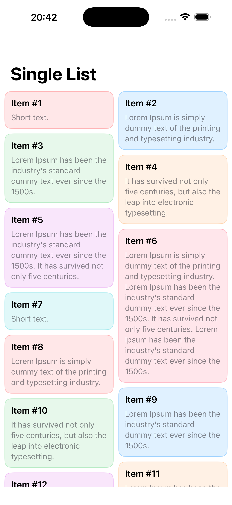
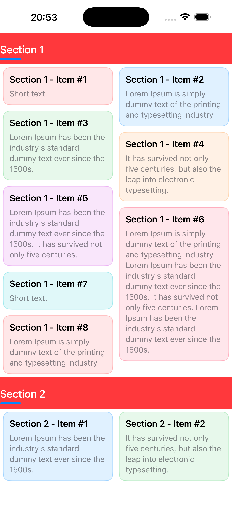
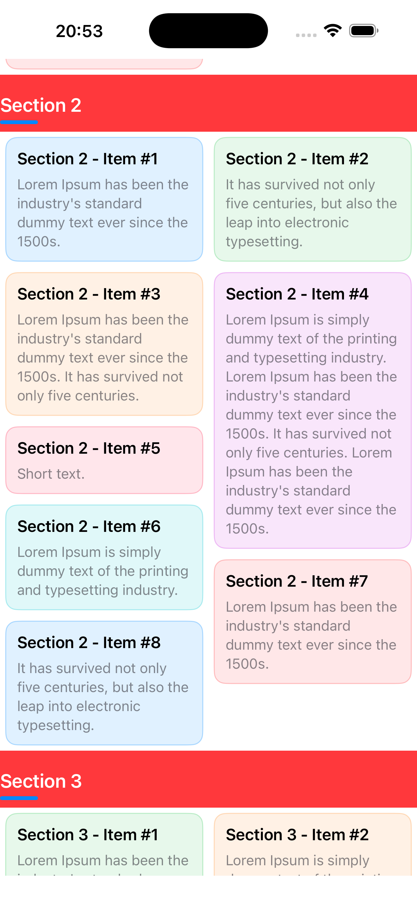
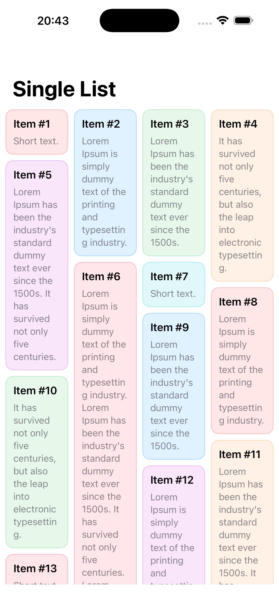

# PinterestVLayout

[](https://swift.org)
[](https://developer.apple.com/ios/)
[](LICENSE)
[](https://swift.org/package-manager/)

A modern, high-performance Pinterest/Masonry style layout framework for SwiftUI with lazy loading, pagination, and multi-section support.

## 🎨 Screenshots

### Single Section Layout


### Multi-Section Layout with Headers
 

### 4-Column Grid


## ✨ Features

- 🎨 **Pinterest-Style Waterfall Layout** - Beautiful masonry grid with dynamic item heights
- 🚀 **Lazy Loading** - Efficiently loads content only when needed
- 📄 **Pagination Support** - Built-in infinite scroll with customizable loading triggers
- 📑 **Multi-Section Architecture** - Organize content with multiple sections and custom headers
- 🎯 **Single Section Mode** - Simplified API for single-list scenarios
- ⚡️ **High Performance** - Optimized with intelligent caching and height calculations
- 🔧 **Fully Customizable** - Configure columns, spacing, and cell content
- 🎭 **SwiftUI Native** - Seamless integration with SwiftUI views
- 📱 **iOS 16+** - Built with the latest Swift features

## 📋 Requirements

- iOS 16.0+
- Swift 6.2+
- Xcode 16.0+

## 📦 Installation

### Swift Package Manager

Add PinterestVLayout to your project using Swift Package Manager:

1. In Xcode, select **File → Add Package Dependencies...**
2. Enter the repository URL:
```
https://github.com/yusufalicezik/PinterestVLayout.git
```
3. Select the version you want to use

Or add it to your `Package.swift` file:

```swift
dependencies: [
    .package(url: "https://github.com/yusufalicezik/PinterestVLayout.git", from: "1.0.0")
]
```

## 🚀 Quick Start

### Single Section Example

Perfect for simple lists with pagination:

```swift
import SwiftUI
import PinterestVLayout

struct ContentView: View {
    @State private var posts: [Post] = []
    @State private var isLoading = false
    
    var body: some View {
        PinterestGrid(
            data: posts,
            columns: 2,
            spacing: 10,
            isLoading: isLoading,
            onLoadMore: { loadNextPage() }
        ) { post in
            PostCardView(post: post)
        }
    }
    
    func loadNextPage() {
        guard !isLoading else { return }
        isLoading = true
        
        // Load your data here
        DispatchQueue.main.asyncAfter(deadline: .now() + 1) {
            // Append new posts
            self.isLoading = false
        }
    }
}
```

### Multi-Section Example

Organize content with headers and sections:

```swift
import SwiftUI
import PinterestVLayout

struct SectionedView: View {
    @State private var sections: [PinterestGridSection<Post>] = []
    
    var body: some View {
        PinterestGrid(
            sections: sections,
            columns: 2,
            spacing: 12
        ) { post in
            PostCardView(post: post)
        } header: { section in
            HeaderView(title: section.title ?? "")
        }
    }
}
```

### Custom Section Headers

Create sections with fully customizable SwiftUI header views:

```swift
let sections = [
    PinterestGridSection(
        id: "trending",
        contentView: VStack(alignment: .leading, spacing: 4) {
            Text("Trending Posts")
                .font(.title3.bold())
                .padding(.top, 12)
            
            Rectangle()
                .fill(Color.accentColor)
                .frame(width: 40, height: 4)
                .cornerRadius(2)
        }
        .padding(.vertical, 8)
        .foregroundStyle(.primary)
        .frame(maxWidth: .infinity, alignment: .leading),
        items: trendingPosts
    )
]
```

## 📚 API Documentation

### PinterestGrid

The main component for creating Pinterest-style layouts.

#### Initializers

**Single Section (No Headers):**

```swift
init(
    data: [Data],
    columns: Int = 2,
    spacing: CGFloat = 10,
    isLoading: Bool = false,
    onLoadMore: @escaping () -> Void = {},
    @ViewBuilder content: @escaping (Data) -> Content
)
```

**Multi-Section (With Headers):**

```swift
init(
    sections: [PinterestGridSection<Data>],
    columns: Int = 2,
    spacing: CGFloat = 10,
    isLoading: Bool = false,
    onLoadMore: @escaping () -> Void = {},
    @ViewBuilder content: @escaping (Data) -> Content,
    @ViewBuilder header: @escaping (PinterestGridSection<Data>) -> Header
)
```

#### Parameters

| Parameter | Type | Default | Description |
|-----------|------|---------|-------------|
| `data` | `[Data]` | - | Array of items for single-section mode |
| `sections` | `[PinterestGridSection<Data>]` | - | Array of sections for multi-section mode |
| `columns` | `Int` | `2` | Number of columns in the grid |
| `spacing` | `CGFloat` | `10` | Spacing between cells |
| `isLoading` | `Bool` | `false` | Loading state for pagination |
| `onLoadMore` | `() -> Void` | `{}` | Callback when reaching bottom (5 items before end) |
| `content` | `(Data) -> Content` | - | ViewBuilder for each item |
| `header` | `(Section) -> Header` | - | ViewBuilder for section headers |

### PinterestGridSection

Model for organizing items into sections.

#### Initializers

**Text-Based Header:**

```swift
init(
    id: AnyHashable = UUID(),
    title: String? = nil,
    items: [Data]
)
```

**Custom View Header:**

```swift
init<V: View>(
    id: AnyHashable = UUID(),
    contentView: V,
    items: [Data]
)
```

#### Properties

| Property | Type | Description |
|----------|------|-------------|
| `id` | `AnyHashable` | Unique identifier for the section |
| `title` | `String?` | Optional title for simple headers |
| `contentView` | `AnyView?` | Custom SwiftUI view for header |
| `items` | `[Data]` | Array of items in this section |

## 🎯 Usage Examples

### Example 1: Photo Gallery with 4 Columns

```swift
struct PhotoGallery: View {
    @State private var photos: [Photo] = []
    
    var body: some View {
        NavigationStack {
            PinterestGrid(
                data: photos,
                columns: 4,
                spacing: 8
            ) { photo in
                AsyncImage(url: photo.url) { image in
                    image
                        .resizable()
                        .aspectRatio(contentMode: .fill)
                        .cornerRadius(8)
                } placeholder: {
                    ProgressView()
                }
            }
            .navigationTitle("Photos")
            .padding(.horizontal, 4)
        }
    }
}
```

### Example 2: Product Catalog with Categories

```swift
struct ProductCatalog: View {
    @State private var sections: [PinterestGridSection<Product>] = []
    @State private var isLoading = false
    
    var body: some View {
        ZStack(alignment: .bottom) {
            PinterestGrid(
                sections: sections,
                columns: 2,
                spacing: 12,
                isLoading: isLoading,
                onLoadMore: { loadMoreProducts() }
            ) { product in
                ProductCard(product: product)
                    .onTapGesture {
                        // Handle product tap
                    }
            } header: { section in
                CategoryHeader(title: section.title ?? "")
            }
            
            if isLoading {
                ProgressView()
                    .padding()
                    .background(.ultraThinMaterial)
                    .clipShape(Circle())
            }
        }
    }
}
```

### Example 3: Custom Item Model

```swift
struct Post: Identifiable, Equatable {
    let id: Int
    let title: String
    let body: String
    let imageURL: URL?
    let color: Color
}

struct PostCardView: View {
    let post: Post
    
    var body: some View {
        VStack(alignment: .leading, spacing: 8) {
            Text(post.title)
                .font(.headline)
                .bold()
            
            Text(post.body)
                .font(.subheadline)
                .foregroundColor(.secondary)
        }
        .padding(12)
        .frame(maxWidth: .infinity, alignment: .leading)
        .background(post.color.opacity(0.12))
        .cornerRadius(12)
        .overlay(
            RoundedRectangle(cornerRadius: 12)
                .stroke(post.color.opacity(0.3), lineWidth: 1)
        )
    }
}
```

## ⚙️ Advanced Configuration

### Pagination Trigger

By default, pagination triggers when the user scrolls to 5 items before the end. You can control the loading state:

```swift
@State private var isLoading = false

PinterestGrid(
    data: items,
    isLoading: isLoading,  // Prevents multiple simultaneous loads
    onLoadMore: {
        loadNextPage()
    }
)
```

### Dynamic Column Count

Adjust columns based on device or orientation:

```swift
@Environment(\.horizontalSizeClass) var sizeClass

var columnCount: Int {
    sizeClass == .regular ? 4 : 2
}

PinterestGrid(
    data: items,
    columns: columnCount,
    spacing: 10
)
```

### Performance Optimization

The layout automatically:
- ✅ Caches cell heights for smooth scrolling
- ✅ Clears cache on orientation changes
- ✅ Uses lazy loading for memory efficiency
- ✅ Reuses cells through UICollectionView

## 🏗️ Architecture

PinterestVLayout uses a hybrid approach combining UIKit's `UICollectionView` with SwiftUI's declarative syntax:

- **PinterestGrid**: SwiftUI wrapper using `UIViewRepresentable`
- **PinterestVLayout**: Custom `UICollectionViewLayout` implementing the waterfall algorithm
- **Height Caching**: Intelligent caching system for smooth scrolling
- **Coordinator Pattern**: Bridges UIKit delegates to SwiftUI

## 🤝 Contributing

Contributions are welcome! Please feel free to submit a Pull Request.

1. Fork the repository
2. Create your feature branch (`git checkout -b feature/AmazingFeature`)
3. Commit your changes (`git commit -m 'Add some AmazingFeature'`)
4. Push to the branch (`git push origin feature/AmazingFeature`)
5. Open a Pull Request

## 🙏 Acknowledgments

- Inspired by Pinterest's grid layout
- Built with SwiftUI and UIKit

---

Made with ❤️ using Swift
